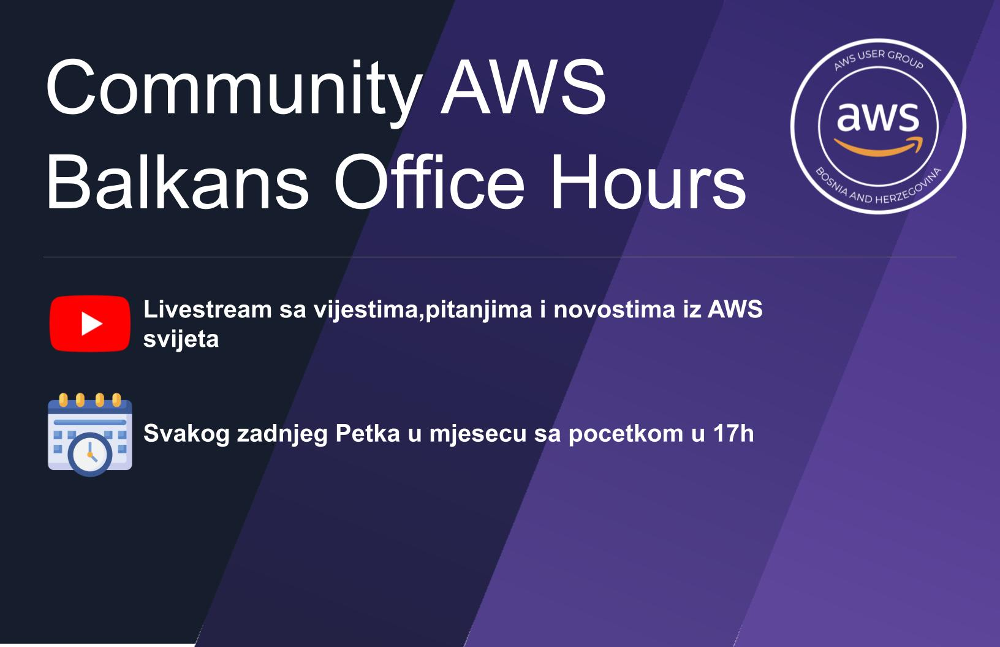

# Community AWS Balkanas Office Hours

Svakog zadnjeg Petka u mjesecu sa pocetkom od 17 sati organizujemo live stream **Community AWS Balkans Office Hours** na kojem razgovaramo i disktujemo o AWS servisima, novostima za AWS servise, desavanjima u lokalnoj AWS zajednici na Balkanu i generalno stvarima koje smatramo da bi bile zanimljive i bitne korisnicima AWS clouda. 

Live Stream mozete pratiti na YouTube-u preko linka ispod:

## Office Hours Recordings  
Snimici dosadasnjih office hours sesija:
- Community AWS Balkans Office Hours - Friday March 31st - [YouTube Video]() | [Biljeske](31-04.2022.md)

## AWS Resources  
- [What's New with AWS?](https://aws.amazon.com/new/)
- [AWS Documentation](https://aws.amazon.com/documentation-overview/)
- [AWS YouTube](https://www.youtube.com/user/AmazonWebServices)
- [AWS Events YouTube](https://www.youtube.com/@AWSEventsChannel)
- [AWS Online Tech Talks YouTube](https://www.youtube.com/@AWSOnlineTechTalks)  
- [AWS Partner Network](https://www.youtube.com/@AWSPartnerNetwork)
- [:octocat: AWS Samples](https://github.com/aws-samples)  
- [:octocat: Amazon Web Services - Labs](https://github.com/awslabs)
- [AWS Architecture Center](https://aws.amazon.com/architecture)
- [AWS Blog](https://aws.amazon.com/blogs/)
- [BuildOn.AWS](https://www.buildon.aws/)
- [AWS Workshops](https://workshops.aws/)
- [AWS Twitch Kanal](https://www.twitch.tv/aws)  
- [AWS re:Post](https://repost.aws/)
- [reddit/r/aws](https://www.reddit.com/r/aws/)
- [AWS Stash](https://awsstash.com/)

## AWS Community Resources
- [dev.to - AWS Heroes](https://dev.to/aws-heroes)  
- [Last Week in AWS](https://ref.lastweekinaws.com/dfiinf)
- Twitter...
## Join AWS User group in your country

- [Find an AWS User Group](https://aws.amazon.com/developer/community/usergroups/?community-user-groups-cards.sort-by=item.additionalFields.ugName&community-user-groups-cards.sort-order=asc&awsf.location=*all&awsf.category=*all)
## Disclaimer 
Community AWS Balkans Office Hours su organizovani od strane AWS zajednice na Balkanu i ne predstavljaja zvanicni AWS dogadjaj. 
